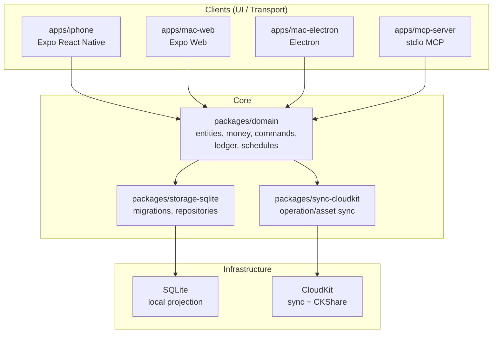
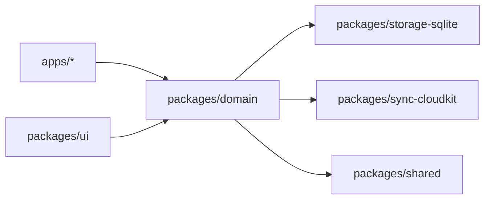
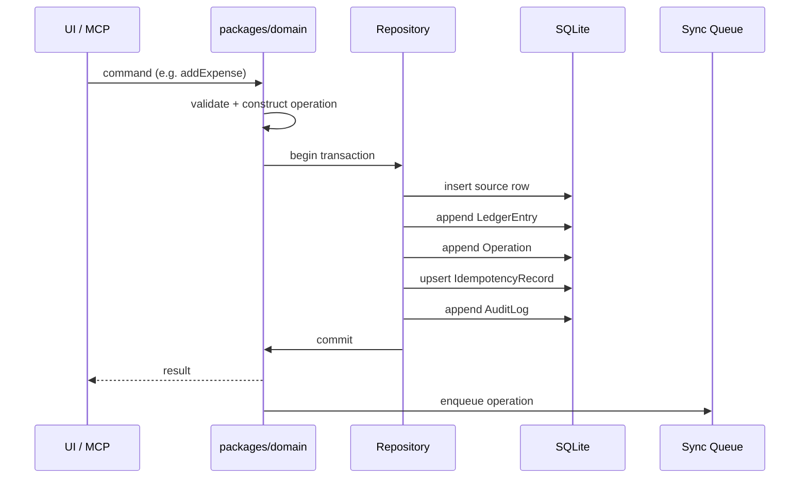
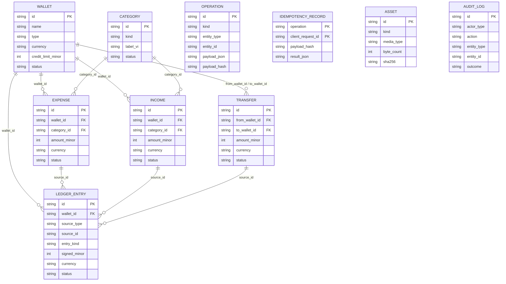
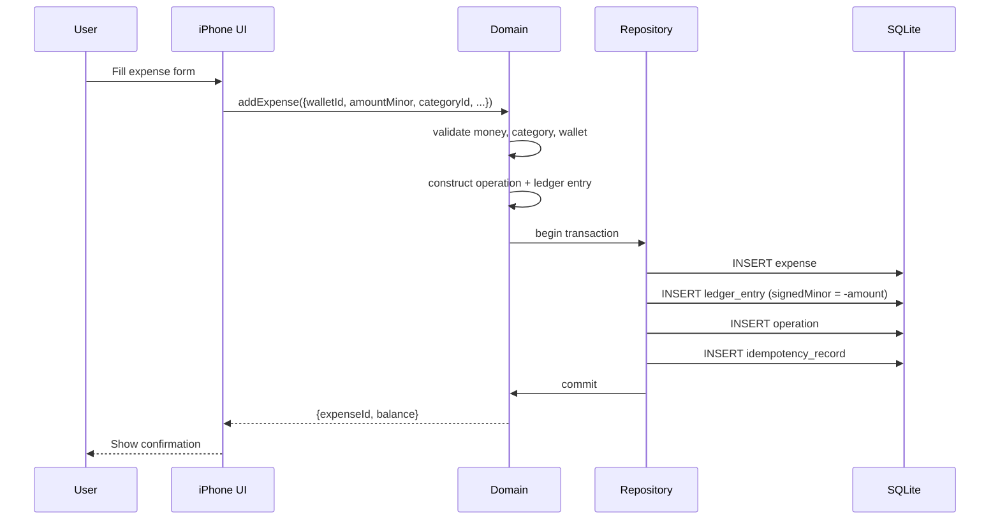
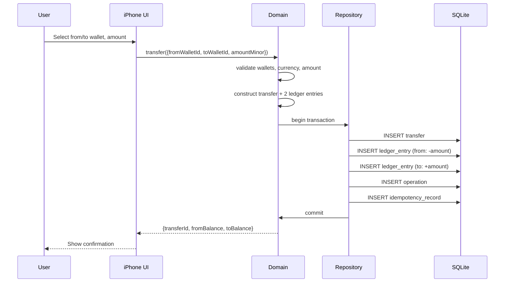
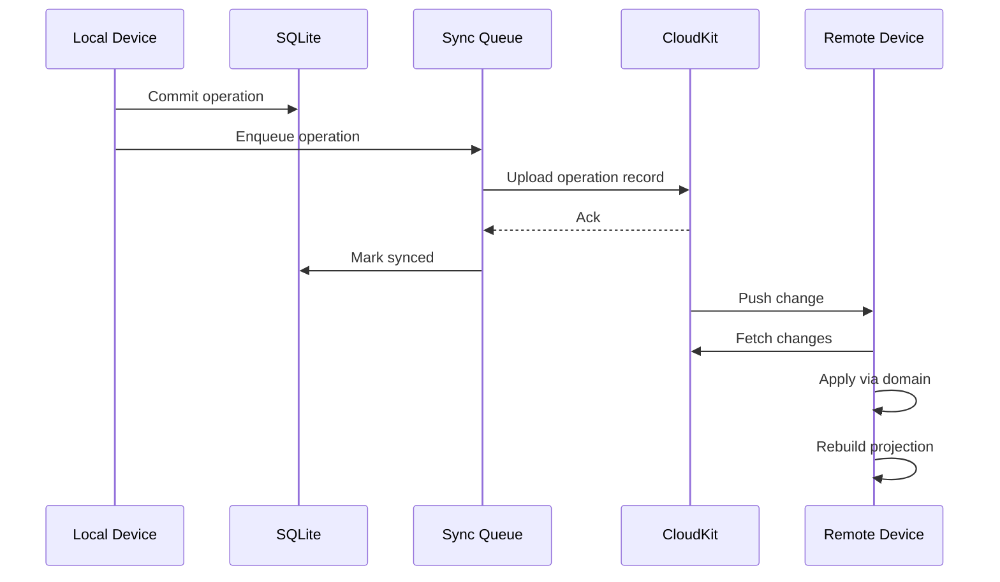
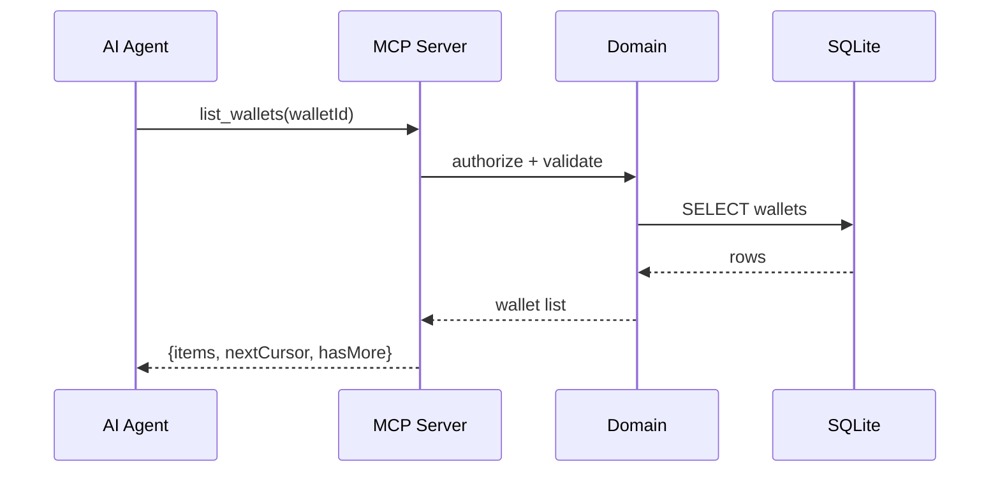
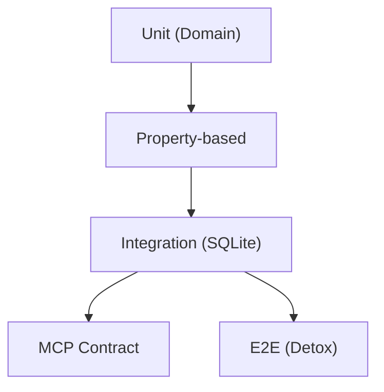

# Expense Tracker — Design Document

> Comprehensive design for a personal finance app: iPhone-first, offline-first, ledger-based, with deterministic sync and an optional AI advisor via MCP.

**Status:** Draft · **Version:** 1.0 · **Updated:** 2026-08-19

This document synthesizes the product specification, system architecture, and normative contracts into a single design reference. It is normative where it restates `PRODUCT_SPEC.md` and the `docs/system/` contracts; elsewhere it is explanatory.

---

## Table of Contents

1. [Overview](#1-overview)
2. [Architecture](#2-architecture)
3. [Data Model](#3-data-model)
4. [Module Design](#4-module-design)
5. [Key Flows](#5-key-flows)
6. [Money Handling](#6-money-handling)
7. [Sync Strategy](#7-sync-strategy)
8. [Security](#8-security)
9. [Testing Strategy](#9-testing-strategy)
10. [Build & Deploy](#10-build--deploy)

---

## 1. Overview

### 1.1 Product Vision

A small, reliable personal finance app that helps users **track where money goes, how much remains, and what to do next** — through fast manual entry and, in Phase 3, an AI agent that reads data directly via MCP.

The app is **iPhone-first** (Phase 1), expands to Mac via Expo Web (Phase 2) and Electron (Phase 3), with optional iCloud sync and family sharing.

### 1.2 Design Principles

| Principle | Meaning |
|-----------|---------|
| **Offline-first** | Every Phase 1 workflow completes without a network. |
| **Ledger-first** | Balances and reports derive from active ledger entries, never mutable cached balances. |
| **Exact money** | Monetary values are signed 64-bit integer minor units plus ISO 4217 currency; JS `number` and SQL `REAL` are forbidden for money. |
| **Immutable financial history** | Corrections use update operations that preserve audit history, or void-and-recreate when wallet/currency/transfer legs change. |
| **One domain implementation** | Business rules live in `packages/domain`; UI and MCP adapters never reimplement them. |
| **Progressive trust** | AI is optional, Phase 3 only, read-only by default, bounded, auditable, and idempotent. |
| **Apple-native privacy** | Private CloudKit databases and CKShare; no custom family backend. |

### 1.3 Tech Stack

| Layer | Technology |
|-------|------------|
| Mobile (Phase 1) | Expo React Native / TypeScript |
| Web wrapper (Phase 2) | Expo Web |
| Desktop (Phase 3) | Electron |
| MCP server (Phase 3) | Node.js / TypeScript over stdio |
| Domain | Pure TypeScript, no platform deps |
| Storage | SQLite via `better-sqlite3` |
| Sync (Phase 2+) | CloudKit |
| State | React hooks + domain repositories |
| Testing | Vitest (unit/integration), Detox (E2E) |
| Lint/Format | ESLint, Prettier, Husky |

### 1.4 Scope by Phase

| Phase | Clients | Key additions |
|-------|---------|---------------|
| **1 — MVP** | iPhone only | Wallets, income, expense, transfer, ledger, dashboard, onboarding, JSON backup |
| **1.5** | iPhone only | Budget, investment, recurring transactions, native receipt OCR |
| **2** | iPhone + Mac Expo Web | CloudKit sync, multi-currency, managed receipt assets |
| **3** | iPhone + Mac Electron | Local MCP server, CKShare family sharing |

Full scope: [PRODUCT_SPEC.md](../PRODUCT_SPEC.md)

---

## 2. Architecture

### 2.1 System Architecture



### 2.2 Module Boundaries

Dependencies point **inward**. `domain` imports no Expo, Electron, SQLite, CloudKit, or MCP module.



### 2.3 Write Path



The repository transaction is the consistency boundary. Phase 2 uploads committed operations **after** local commit; CloudKit availability is never a prerequisite for a local write.

### 2.4 Read Path

Screens and MCP query local projections through repositories. Queries use stable `(occurredAtUtc, id)` cursor ordering, bounded filters, and never read raw CloudKit records in presentation code.

### 2.5 Platform Decisions

| Phase | Runtime | Notes |
|-------|---------|-------|
| 1/1.5 | Expo React Native | iPhone only |
| 2 | Expo Web wrapper | Mac via browser, no Node privileges |
| 3 | Electron | Hardened preload/IPC, context isolation |
| 3 | MCP stdio | Local child process, no network listener |

---

## 3. Data Model

### 3.1 Entity Relationship



### 3.2 Shared Types

```typescript
type MinorUnits = bigint;           // serialize as base-10 string in JSON
type Money = { minorUnits: string; currency: ISO4217 };
type InstantWithOffset = { utc: string; offsetMinutes: number };
type Status = 'active' | 'voided';
```

### 3.3 Key Invariants

- **IDs**: UUID v4 strings; recurring occurrence IDs are UUID v5 derived from `scheduleId + dueLocalDate`.
- **Money**: `{ minorUnits: string, currency: string }` at JSON boundaries; 64-bit `INTEGER` in SQLite.
- **Timestamps**: `*_at_utc` is RFC 3339 UTC instant ending `Z`; `*_offset_minutes` is `[-840, 840]`.
- **Status**: Financial entities and `LedgerEntry` have `status IN ('active','voided')`.
- **Assets**: Local paths are adapter-private and never persisted as domain identifiers.
- **Operations**: Every write emits an immutable `Operation` row. Financial writes also store an `IdempotencyRecord`.

Full schema: [docs/system/01-data-model.md](system/01-data-model.md)

---

## 4. Module Design

### 4.1 `packages/domain`

**Responsibility:** Canonical entities, money types, invariants, ledger posting, recurring schedules, commands.

**Public API:**
- `Money` — parse, format, add, subtract, multiply with overflow checks
- `Entities` — `Wallet`, `Expense`, `Income`, `Transfer`, `LedgerEntry`, `Operation`
- `Commands` — `addExpense`, `addIncome`, `transfer`, `void`, `update`
- `Ledger` — `postExpense`, `postIncome`, `postTransfer`, `voidEntries`
- `Schedules` — `generateRecurring`, `catchUpMissedPeriods`
- `Validation` — `validateExpense`, `validateTransfer`, `validateMoney`

**Dependencies:** None (pure TypeScript).

**Rules:**
- No platform imports (Expo, Electron, Node).
- No direct SQLite or CloudKit access.
- All monetary arithmetic uses `BigInt`.

### 4.2 `packages/storage-sqlite`

**Responsibility:** SQLite migrations, repositories, query execution.

**Public API:**
- `createConnection(path)` — open SQLite with `PRAGMA foreign_keys = ON`
- `migrate(db)` — run numbered migrations
- Repositories: `walletRepo`, `expenseRepo`, `incomeRepo`, `transferRepo`, `ledgerRepo`, `operationRepo`, `idempotencyRepo`, `auditRepo`

**Dependencies:** `packages/domain`, `better-sqlite3`.

### 4.3 `packages/sync-cloudkit`

**Responsibility:** Operation and asset sync with CloudKit (Phase 2+).

**Public API:**
- `uploadOperation(op)` — enqueue and upload
- `fetchChanges(token)` — fetch zone changes
- `applyRemoteOperation(op)` — apply through domain
- `uploadAsset(asset)` — upload receipt file

**Dependencies:** `packages/domain`, CloudKit JS bridge.

### 4.4 `packages/shared`

**Responsibility:** Shared TypeScript types, constants, utilities.

**Dependencies:** None.

### 4.5 `packages/ui`

**Responsibility:** Platform-neutral UI components (atoms, molecules).

**Dependencies:** `packages/domain`, `packages/shared`.

### 4.6 `apps/iphone`

**Responsibility:** Expo React Native iPhone app (Phase 1+).

**Dependencies:** `packages/domain`, `packages/storage-sqlite`, `packages/ui`, `packages/shared`.

### 4.7 `apps/mac-web`

**Responsibility:** Expo Web wrapper for Mac (Phase 2+).

**Dependencies:** Same as `apps/iphone`.

### 4.8 `apps/mac-electron`

**Responsibility:** Electron Mac app (Phase 3+).

**Dependencies:** `packages/domain`, `packages/storage-sqlite`, `packages/sync-cloudkit`.

### 4.9 `apps/mcp-server`

**Responsibility:** Local MCP server over stdio (Phase 3+).

**Dependencies:** `packages/domain`, `packages/storage-sqlite`.

---

## 5. Key Flows

### 5.1 Record Expense



### 5.2 Transfer Between Wallets



### 5.3 CloudKit Sync (Phase 2)



### 5.4 MCP Query (Phase 3)



---

## 6. Money Handling

### 6.1 Representation

Money is **signed 64-bit integer minor units** plus ISO 4217 currency.

```typescript
// JSON boundary
{ minorUnits: "100000", currency: "VND" }  // 1,000.00 VND

// SQLite storage
INTEGER  -- signed, range [-9223372036854775808, 9223372036854775807]

// TypeScript
type MinorUnits = bigint;
```

### 6.2 Forbidden Types

| Context | Forbidden | Reason |
|---------|-----------|--------|
| JavaScript | `number` | 53-bit mantissa loses precision |
| SQLite | `REAL` | Binary float rounding |
| JSON | number for money | Precision loss in serialization |
| Arithmetic | `+`, `-`, `*`, `/` on `number` | Implicit float conversion |

### 6.3 Parsing

Decimal strings are parsed as text with currency scale and range checks:

```typescript
parseMoney("1000.50", "VND") // Error: VND has scale 0
parseMoney("1000", "VND")    // OK: { minorUnits: "1000", currency: "VND" }
parseMoney("10.99", "USD")   // OK: { minorUnits: "1099", currency: "USD" }
```

### 6.4 Overflow Protection

All arithmetic operations check for 64-bit signed integer overflow:

```typescript
add(a: MinorUnits, b: MinorUnits): MinorUnits
subtract(a: MinorUnits, b: MinorUnits): MinorUnits
multiply(a: MinorUnits, factor: number): MinorUnits  // factor is integer
```

### 6.5 Currency Rules

- Currency is uppercase 3-letter ISO 4217.
- Each wallet has a fixed currency.
- Transfer between different-currency wallets requires an exchange rate snapshot (Phase 2+).
- `amountMinor` on source entities is always positive; `signedMinor` on ledger entries carries the projection sign.

---

## 7. Sync Strategy

### 7.1 Operation-Based Sync

Financial state is **operation-based**, not last-writer-wins. Every write emits an immutable `Operation` that is synced to CloudKit.


### 7.2 Conflict Resolution

| Scenario | Resolution |
|----------|------------|
| Duplicate ID + same hash | Idempotent (ignore) |
| Same ID + different hash | Quarantine and surface to user |
| Transfer legs | Both apply in one transaction or neither |
| Concurrent edits to voided entity | Reject edit |
| Non-financial metadata | Documented field-level merge |

### 7.3 Idempotency

Canonicalize validated input (sorted keys, normalized strings, monetary strings, UTC timestamps), hash with SHA-256, and look up `(operation, clientRequestId)` inside the write transaction.

- Same hash → return stored result
- Different hash → `IDEMPOTENCY_CONFLICT`
- Financial keys never expire
- Dry-runs neither create nor consume keys

### 7.4 Failure Model

| Failure | Behavior |
|---------|----------|
| SQLite write failure | Roll back every projection, ledger, operation, and idempotency change |
| Sync failure | Retain operation in outbox, retry with bounded exponential backoff |
| Asset failure | Keep metadata pending; never claim sync until checksum verifies |
| Projection corruption | Rebuild from immutable operations after validating backup |
| Token expiration | Full zone enumeration without deleting unsynced local operations |

Full sync contract: [docs/system/05-cloudkit.md](system/05-cloudkit.md)

---

## 8. Security

### 8.1 Trust Boundaries

- **iOS/macOS sandbox** and **CloudKit identity/permissions** are security boundaries.
- **Face ID/Touch ID** is a privacy gate, not authentication.
- **Electron renderer** and **MCP clients** are untrusted inputs.

### 8.2 Local Data Protection

- Database and assets in sandbox-managed directories with iOS Data Protection.
- macOS: `0600` files, `0700` directories.
- Keys/tokens in Keychain, never SQLite or logs.
- Temporary OCR images excluded from backups.

### 8.3 Logging Redaction

Logs **must not** contain:
- Money amounts, merchant, note
- OCR text, receipt content/path
- Backup content, CloudKit tokens
- Raw MCP arguments

### 8.4 MCP Security (Phase 3)

- `EXPENSE_MCP_READONLY` defaults to `true`.
- No network listener (stdio only).
- Bounded inputs, results, time.
- `clientRequestId` + dry-run on all writes.
- Audit logging for committed writes.

Full security contract: [docs/system/06-security.md](system/06-security.md)

---

## 9. Testing Strategy

### 9.1 Test Pyramid



### 9.2 Test Categories

| Category | Scope | Tools |
|----------|-------|-------|
| **Unit** | Domain functions, money parsing, validation | Vitest |
| **Property-based** | Ledger conservation, overflow boundaries, transfer two-leg conservation | Vitest + fast-check |
| **Integration** | SQLite repositories, migrations, idempotency | Vitest + in-memory SQLite |
| **E2E** | Full user flows on iPhone | Detox |
| **MCP Contract** | Schemas, `structuredContent`, `isError`, read-only default, dry-run, audit | Vitest |
| **Sync Convergence** | Duplicate, reordered, offline delivery; token reset | Simulator + CloudKit sandbox |

### 9.3 Key Test Invariants

- **Ledger conservation**: `Σ active LedgerEntry.signedMinor` equals wallet balance after any sequence of create/update/void.
- **Transfer conservation**: Every active transfer has exactly two opposite/equivalent legs.
- **Money round-trip**: All supported currency scales parse and serialize exactly.
- **Idempotency**: Same `clientRequestId` returns stored result; different payload yields conflict.
- **Backup round-trip**: All entities, assets, settings, operations, and recurring state restore identically.

### 9.4 CI Pipeline

```mermaid
graph LR
    A[Push] --> B[Lint + Format]
    B --> C[Unit Tests]
    C --> D[Integration Tests]
    D --> E[Build]
    E --> F[E2E (device)]
```

---

## 10. Build & Deploy

### 10.1 Monorepo Structure

```text
expense-tracker/
├── apps/
│   ├── iphone/          # Expo React Native
│   ├── mac-web/         # Expo Web wrapper
│   ├── mac-electron/    # Electron shell
│   └── mcp-server/      # MCP stdio server
├── packages/
│   ├── domain/          # Canonical rules
│   ├── storage-sqlite/  # SQLite repositories
│   ├── sync-cloudkit/   # CloudKit sync
│   ├── shared/          # Shared types
│   └── ui/              # Platform-neutral UI
├── docs/
│   ├── system/          # Normative contracts
│   ├── features/        # Feature specs
│   └── phases/          # Phase plans
├── package.json         # Root scripts
├── pnpm-workspace.yaml  # Workspace config
└── tsconfig.base.json
```

### 10.2 Key Scripts

| Command | Purpose |
|---------|---------|
| `pnpm dev:mobile` | Start Expo dev server |
| `pnpm dev:desktop` | Start Electron dev |
| `pnpm dev:mcp` | Start MCP server |
| `pnpm test` | Run domain tests |
| `pnpm lint` | ESLint check |
| `pnpm format` | Prettier check |
| `pnpm build:all` | Build all workspaces |

### 10.3 Husky Hooks

| Hook | Command |
|------|---------|
| `pre-commit` | `lint-staged` (ESLint + Prettier on staged files) |
| `pre-push` | `pnpm test` |

### 10.4 Release Process

1. **Phase gate**: All acceptance criteria pass for the phase.
2. **Migration test**: Every released fixture migrates successfully.
3. **Backup test**: Previous version backup restores correctly.
4. **Schema lint**: Schema and docs match shipped behavior.
5. **Privacy check**: No sensitive content in logs/telemetry.
6. **Build**: Release build passes unit, integration, E2E, accessibility tests.
7. **Deploy**: App Store (iPhone), notarized DMG (Electron).

### 10.5 Environment Requirements

| Requirement | Version |
|-------------|---------|
| Node.js | >= 22.0.0 |
| pnpm | >= 8.0.0 |
| iOS | >= 16 (Phase 1) |
| macOS | >= 14 (Phase 2+) |

---

## Appendix A: Document Map

| Document | Purpose |
|----------|---------|
| [PRODUCT_SPEC.md](../PRODUCT_SPEC.md) | Product specification (normative) |
| [docs/system/01-data-model.md](system/01-data-model.md) | Canonical data model (normative) |
| [docs/system/02-architecture.md](system/02-architecture.md) | System architecture (normative) |
| [docs/system/03-ledger.md](system/03-ledger.md) | Ledger and accounting (normative) |
| [docs/system/04-mcp-protocol.md](system/04-mcp-protocol.md) | MCP protocol contract (normative) |
| [docs/system/05-cloudkit.md](system/05-cloudkit.md) | CloudKit sync (normative) |
| [docs/system/06-security.md](system/06-security.md) | Security and privacy (normative) |
| [docs/system/07-backup.md](system/07-backup.md) | Backup and restore (normative) |
| [docs/phases/](phases/) | Phase plans and milestones |
| [docs/features/](features/) | Feature specifications |
| [AGENTS.md](../AGENTS.md) | Agent instructions and skill pipeline |

## Appendix B: Glossary

| Term | Definition |
|------|------------|
| **Minor unit** | Smallest currency unit (e.g., 1 VND, 1 cent = 0.01 USD) |
| **Ledger entry** | Append-only signed projection of a financial event |
| **Operation** | Immutable record of a write, used for sync and audit |
| **Idempotency record** | Durable mapping of `(operation, clientRequestId)` to result |
| **Projection** | Derived state (balances, totals) computed from ledger entries |
| **Void** | Atomic status transition from `active` to `voided` |
| **CKShare** | Apple CloudKit sharing mechanism for family access |
| **MCP** | Model Context Protocol — local stdio server for AI agents |
